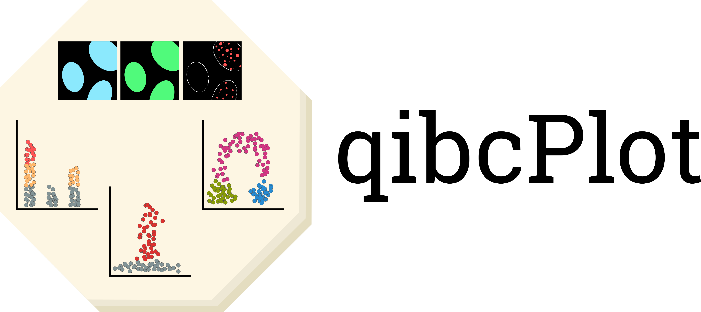
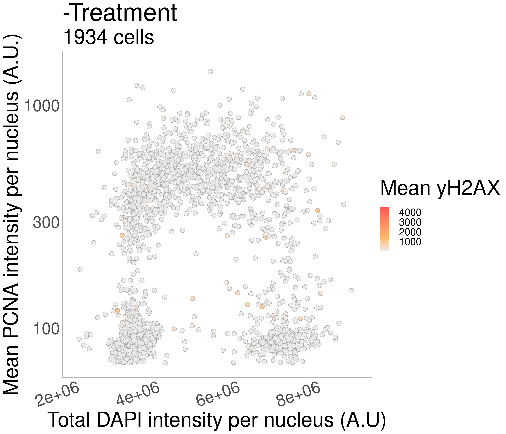
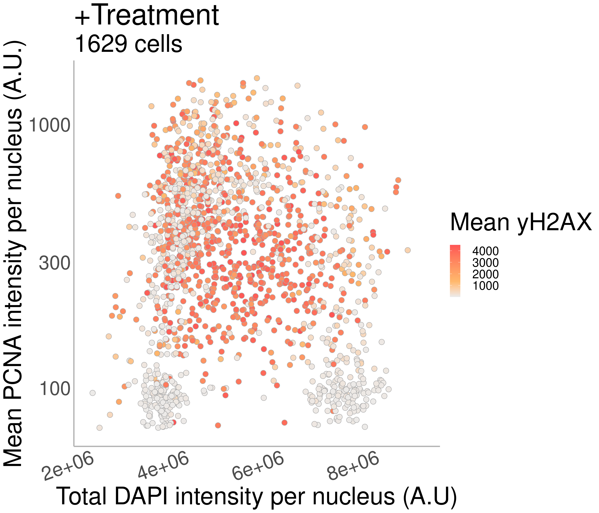
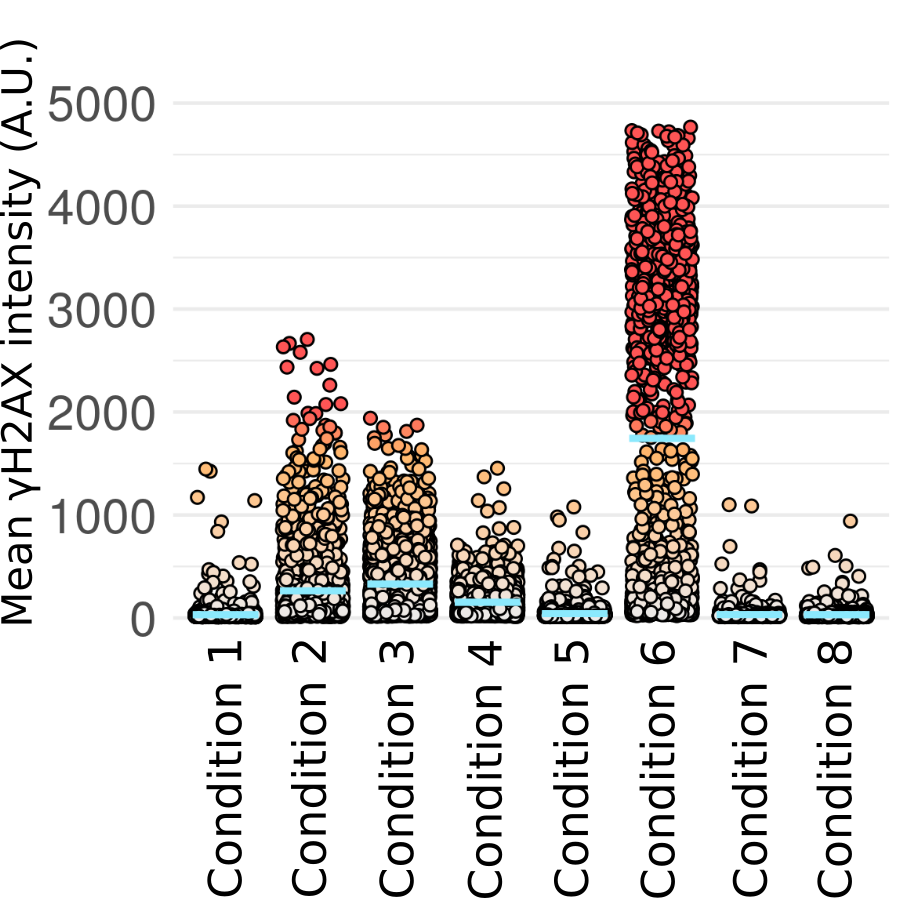

<p align="center">
  
</p>

# qibcScripts

qibcScripts offers a methodology for the creation of intuitive plots of quantitative imaging data using **R**.

Quantitative Image Based Cytometry (QIBC) aims to derive further detail from microscopy data. Previously, QIBC has been limited to propriety microscopy software (ScanR) and propriety data visualisation software (Spotfire). The qibcScripts shared here offer a method for the creation of intuitive and pretty visualisations using the ggplot2 package in **R**. For the acquisition of quantitative image data, a general **CellProfiler** pipeline has been provided.

As a whole, this repo also aims to provide end-to-end methodology for creating and plotting QIBC data from your microscope images. An example CellProfiler pipeline and considerations for using CellProfiler can be [found here](/cellprofiler-pipeline).

The R script for analysis of the output from CellProfiler can be found in the [`qibcScripts` folder here](qibcScripts). An example dataset (`Nuelci.csv`) for testing this script can be found in the `example-data` folder.

### Interactive application for exploring QIBC data
[Here](shinyapp-web) you can find an online application to explore how the 3var plots look and how they can be manipulated. [Here](shinyapp-local) you can find the shiny app which you can run locally with your own data.

## Example Plots
### 3var scatter plot
<p align="left">
  
  
</p>


### Dot bar plot
<p align="left">
  
</p>

*Blue lines represent the mean intensity for the population per condition*


### Contributuion
If you have an idea for a new QIBC visualisation or want to change something, please submit a pull request or raise an issue.

```
test = is.the.code.working()
>>> yes
```
